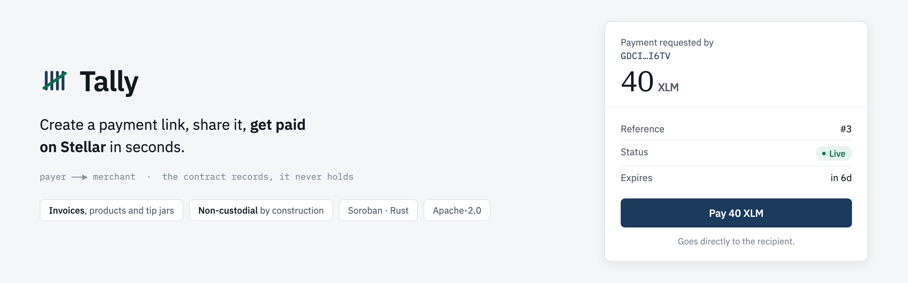
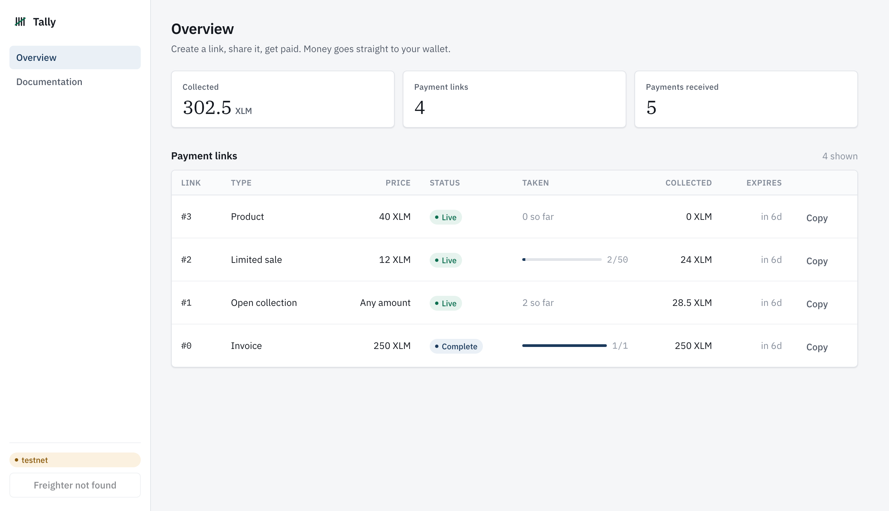
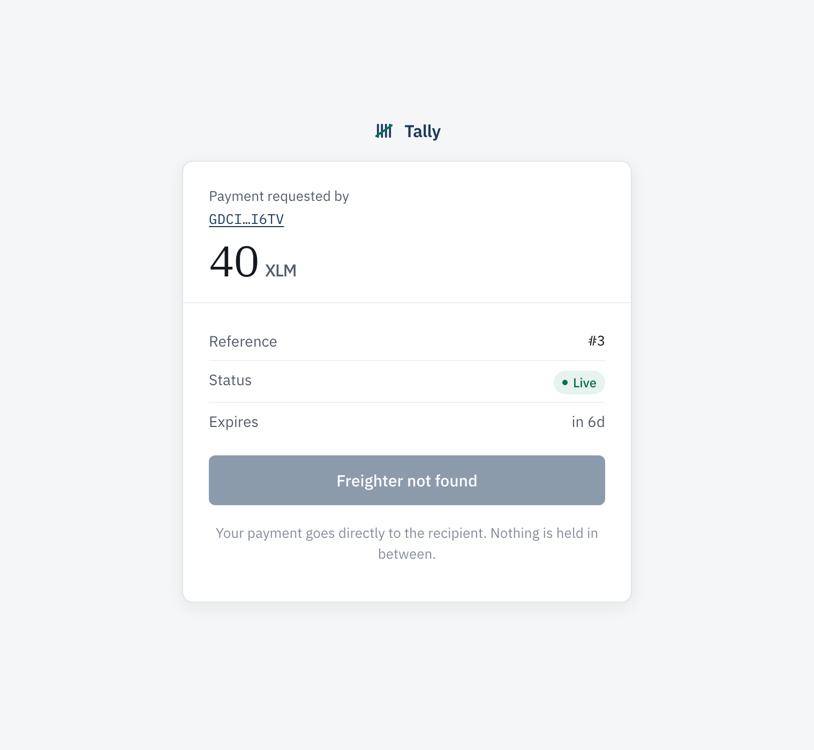
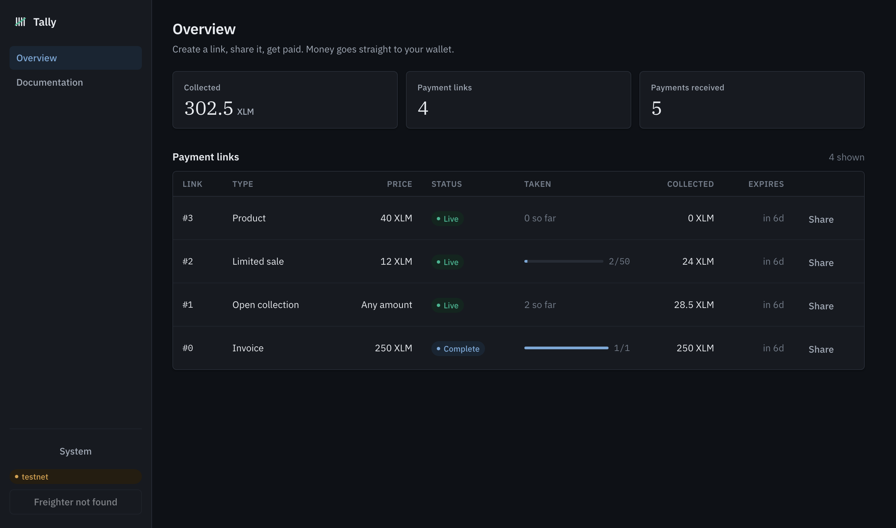

<p align="center">
  
</p>

# Tally

**Turn a price into a link. Send it. Get paid on Stellar.** An invoice, a
product with limited stock, or a tip jar — all the same primitive, all one URL
you can paste into a message.

The contract that records the payment **never holds it**. `pay` moves tokens
straight from your customer to you and writes the record in the same
transaction. There is no pooled balance to attack, no withdrawal path to get
wrong, and nothing for you to claim afterwards.

```
customer opens /pay/42 ──▶ signs once ──▶ tokens land in the merchant's wallet
                                     └──▶ the payment is recorded against link 42
```

## Live

| | |
| --- | --- |
| **App** | **<https://cansarihan.github.io/tally/>** |
| **Testnet registry** | [`CCKFGICF5BOWRXXWC6KSGZQ3UIL6BT23ZO3RIMLNQA7M5XNB6PZT5WKR`](https://stellar.expert/explorer/testnet/contract/CCKFGICF5BOWRXXWC6KSGZQ3UIL6BT23ZO3RIMLNQA7M5XNB6PZT5WKR) |
| **Wasm hash** | `293b2acc6e8b7133537c3f46defb31e4c57c89cd7a3f33e16e4021a7626efd33` |

The deployed contract is verifiably this source. All three hashes agree:

```
local  ./scripts/build.sh                                          293b2acc…626efd33
CI     printed on every run                                        293b2acc…626efd33
chain  stellar contract fetch --id <ID> --network testnet | shasum  293b2acc…626efd33
```

## What it looks like

The dashboard is a payments back office: what came in, through which link, and
what is still open.

<p align="center">
  
</p>

The checkout is the only surface most people ever meet, so it says who is
asking, how much, and nothing else.

<p align="center">
  
</p>

It follows the reader's system theme, and the choice can be overridden:

<p align="center">
  
</p>

Screenshots are the live testnet registry, seen without a wallet connected. A
merchant's record is public on chain, so `?merchant=<address>` renders it
read-only — handy for checking takings on a phone.

> [!IMPORTANT]
> On GitHub Pages a payment link such as `/pay/3` **loads correctly but returns
> HTTP 404**, because Pages cannot rewrite unknown paths and only falls back to
> a copied `404.html`. Messaging apps and crawlers read that status and treat
> the link as broken. Host on Vercel for production: `vercel.json` rewrites
> every path to `index.html`, so payment links answer `200`.

## One primitive, four products

Two fields are allowed to be zero, and that is the entire product surface:

| Price | Quantity | What you get |
| --- | --- | --- |
| fixed | 1 | **Invoice** — closes itself once paid |
| fixed | *n* | **Limited sale** — *n* seats, tickets or units |
| fixed | unlimited | **Product** — sell it as long as you like |
| any | unlimited | **Collection** — a tip jar; the payer chooses |

The composer asks which of these you want. The contract only sees the numbers.

## Quick start

```bash
rustup target add wasm32v1-none
cargo install --locked stellar-cli
npm ci

cargo test              # 22 contract tests
npm test                # 18 web tests
./scripts/build.sh      # builds the wasm and prints its hash
```

Run the app against the testnet registry:

```bash
cp web/.env.example web/.env
npm run dev             # http://localhost:5173
```

Deploy your own registry:

```bash
./scripts/deploy.sh testnet <source-key>
```

## Layout

| Path | What lives there |
| --- | --- |
| `contracts/links` | The Soroban contract. Rust, `no_std`. |
| `packages/tally-client` | TypeScript client generated from the deployed spec. |
| `web` | Dashboard and checkout. React, Vite, Freighter. |
| `scripts` | Build, deploy and binding generation. |
| `docs` | Everything below. |

## Documentation

| | |
| --- | --- |
| [Architecture](docs/architecture.md) | How it fits together, and why there is no custody |
| [Security review](docs/security.md) | Threat model, invariants, findings, and what is *not* verified |
| [Deployment](docs/deployment.md) | Testnet through mainnet, Vercel and Pages |
| [User guide](docs/user-guide.md) | For merchants and for the people paying them |
| [Growth report](docs/growth.md) | The monthly numbers, with the commands to reproduce them |
| [User feedback](docs/onboarding/README.md) | Form spec and how a user is counted as verified |
| [Technical note](docs/blog/a-payment-contract-that-holds-nothing.md) | Why this contract holds nothing, and what that costs |

## Testing

40 tests, all run in CI on every push.

| Suite | Count | Covers |
| --- | --- | --- |
| `cargo test` | 22 | Pricing, capacity, expiry, closure, records, and that the contract's balance is always zero |
| `web` | 18 | Exact amount handling and derived link state |

CI also enforces `rustfmt`, `clippy -D warnings`, TypeScript strict mode and
`npm audit --audit-level=high`, and prints the wasm hash for comparison.

## Growth

The [growth report](docs/growth.md) carries the numbers and the commands to
reproduce each one. Metrics that cannot yet be measured say so rather than
showing a zero that looks like a measurement.

### What changed, and why

| Finding | Change | Commit |
| --- | --- | --- |
| A CSS element selector outranked the amount's own class, so the figure a customer is asked to pay rendered at label size | Scoped the label to a class; the amount is the largest thing on the card again | `git log --grep "merchant dashboard and checkout"` |
| Suppressing build output hid a failing build, and a stale bundle with no contract id was served | Build output is no longer piped away in any workflow here | `.github/workflows/ci.yml` |
| Checking a link from a phone meant connecting a wallet first | `?merchant=<address>` renders any merchant's public record read-only | `git log --grep "merchant dashboard and checkout"` |

## Status

Honest about what is done and what is not.

| Requirement | Status |
| --- | --- |
| Public repository | ✅ |
| 30+ meaningful commits | ✅ |
| Contract on testnet, verified end to end | ✅ |
| Live production application | ✅ on GitHub Pages; ⏳ Vercel recommended — see the note below |
| Updated documentation | ✅ |
| Security review | ✅ written; ⏳ awaiting sign-off |
| Mainnet deployment | ⏳ [runbook ready](docs/deployment.md) |
| 50+ new mainnet users | ⏳ needs mainnet |
| Mainnet transaction proof | ⏳ needs mainnet |
| User feedback sheet | ⏳ [spec ready](docs/onboarding/README.md) |
| Monthly growth report | ✅ [first period recorded](docs/growth.md) |
| Product improvement commit links | ✅ |
| Social media growth, update posts | ⏳ |
| Community contribution | ✅ [written](docs/blog/a-payment-contract-that-holds-nothing.md); ⏳ awaiting publication |

## Licence

Apache-2.0. See [LICENSE](LICENSE).
